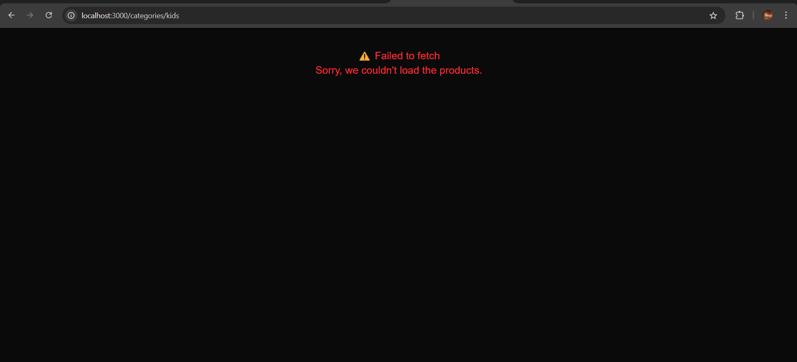
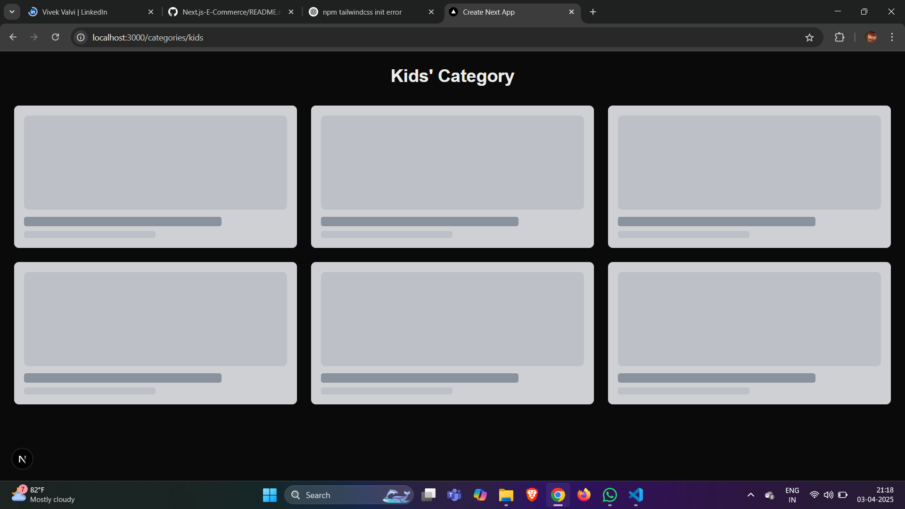
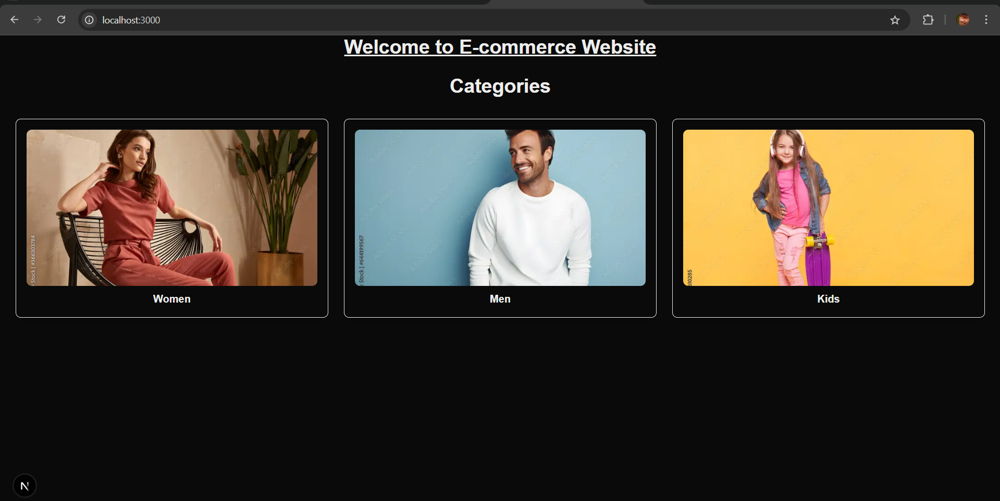
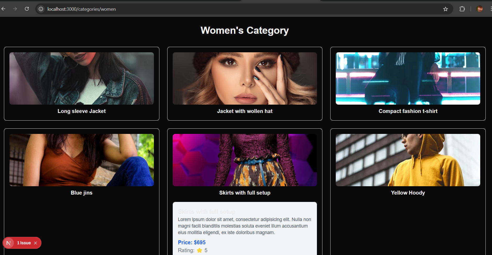

🛍 Next.js E-Commerce Category Page ()

🚀 Project Overview
This project is a Next.js-based E-Commerce Category Page that fetches and displays products from an API. The application is designed to showcase Men, Women, and Kids categories with an optimized user experience, lazy loading images, skeleton loaders, and error handling for API failures (including 404 errors).

🏗 Features
✔ Dynamic Product Fetching – Uses useEffect to fetch category-specific products.
✔ Error Handling – Displays a custom 404 error message if products fail to load.
✔ Skeleton Loaders – Shows placeholder UI while fetching data (5-8 seconds simulated delay).
✔ Lazy Loading Images – Improves page speed by only loading images when needed.
✔ Responsive Design – Styled with Tailwind CSS for a clean, modern UI.

📸 Preview
(Attach screenshots or GIFs of your project here)
   

🛠 Tech Stack
Framework: Next.js

Styling: Tailwind CSS

State Management: React useState and useEffect hooks

API: FakeStore API

🏗 Project Structure

📦 my-nextjs-project
 ┣ 📂 src
 ┃ ┣ 📂 app
 ┃ ┃ ┣ 📂 men  # Men Category Page
 ┃ ┃ ┣ 📂 women  # Women Category Page
 ┃ ┃ ┣ 📂 kids  # Kids Category Page
 ┃ ┃ ┣ 📜 globals.css  # Tailwind CSS Global Styles
 ┃ ┃ ┣ 📜 layout.js  # Global Layout
 ┃ ┃ ┗ 📜 page.js  # Home Page
 ┣ 📂 public  # Static Assets
 ┣ 📜 tailwind.config.js  # Tailwind Configuration
 ┣ 📜 next.config.js  # Next.js Configuration
 ┣ 📜 package.json  # Dependencies
 ┣ 📜 README.md  # Project Documentation
🔧 Installation & Setup
1️⃣ Clone the Repository
git clone https://github.com/your-username/nextjs-ecommerce.git
cd nextjs-ecommerce
2️⃣ Install Dependencies
npm install
3️⃣ Run the Development Server
npm run dev
Your application will run at http://localhost:3000

